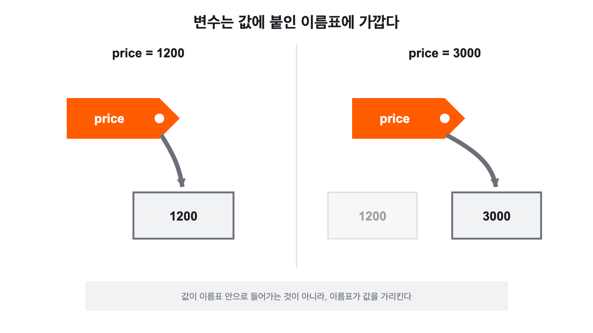

# 교과서 배포 — 작업 안내

`교과서_설계/`의 원고를 학생용 HTML 교과서로 만든 결과물이다. 설계 원고를 그대로 옮긴 것이 아니라 [[08 교과서 집필 기준]]의 §4(이론 차시 13단계)·§5(실습 차시 16단계)·§6(용어 5단계)·§9(깊이 표시)에 맞춰 확장했다. **본문은 한국어와 중국어를 함께 담고 있으며 상단 `中文` 버튼으로 전환한다.**

디자인은 **바이브코딩연구소 2026 브랜드**를 따른다. 규격은 `2608-02_harness_v2/templates/`의 `19 교재.dc.html`과 `brand/문서-스타일-스펙.md`이며, 이 폴더에서는 `assets/textbook.css` 하나로 28개 파일 전체에 적용된다. 자세한 내용은 §10.

## 1. 현재 상태

2026-08-25 1주차 수업 후 피드백을 반영해 2026-08-29에 1–4주차 구성을 다시 정리했다. 전체 13회·26개 차시 틀과 수행평가 3회 구조는 유지하고, 초반 차시의 분량과 실습 순서를 초보 학생에 맞게 재편했다.

| 차시 | 파일 | 쪽 | 유형 | 현재 핵심 |
|---|---|---:|---|---|
| — | `index.html` | 10 | 표지·목차 | 1–4주차 제목·소개 갱신 |
| — | `index-nobrand.html` | 10 | 표지·목차 | 회사 표기 없는 공유본 |
| 1-1 | `01/textbook/01-1.html` | 24 | 오리엔테이션 | 2–4주차 로드맵 표현 갱신 |
| 1-2 | `01/textbook/01-2.html` | 19 | 이론 | 수업 후 CPU·RAM·저장장치 작업 공간 비유 시각 자료 추가 |
| 2-1 | `02/textbook/02-1.html` | 16 | 설치·확인 | 실제 결과 예시 → Python → OpenCode(Node.js는 설치 수단) → VS Code·Python 확장 → 제공자·모델 연결과 첫 확인, CLI는 확인·대화 용도 |
| 2-2 | `02/textbook/02-2.html` | 11 | 기초 실습 | 숫자·문자·print·변수·기본 산술연산만 사용 |
| 2-3 | `02/textbook/02-3.html` | 10 | 기초 이론 | 주소에서 출발해 인터넷·웹·서버와 프로그래밍 언어의 역사를 살펴보는 흐름 |
| 3-1 | `03/textbook/03-1.html` | 7 | 기초 이론+실습 | 비교연산과 True·False, 기준 확인 |
| 3-2 | `03/textbook/03-2.html` | 7 | 환경+자료구조 | uv·`.venv`·Jupyter 커널, list·dict |
| 4-1 | `04/textbook/04-1.html` | 7 | 그래프 이해 | Matplotlib 기반, 그래프 유형·축·원본 확인 |
| 4-2 | `04/textbook/04-2.html` | 8 | 표 데이터 실습 | pandas·DataFrame, Notebook·CSV 제출 연결 |
| 5-1–13-2 | 해당 HTML | 313 | 평가·기획·구현 | 2026-08-29 기준 기존 구성 유지 |
| 9-0 | `09/textbook/09-0.html` | 9 | AI 개발 조건 | 학생용 제약 안내 |
| 9-13 | `별도배포/09-13.html` | 24 | 교사용 | 개발 수업 준비자료 |

**2-1–4-2는 스크롤·슬라이드·인쇄에서 같은 HTML을 사용한다.** 2-1은 16쪽, 2-2는 11쪽, 2-3·3-1·3-2·4-1은 각 7쪽, 4-2는 8쪽이다. 2-1은 학생이 교과서만 보고 설치·확인을 따라갈 수 있도록 VS Code 화면·Python 확장·OpenCode 오류 대응·제공자 연결·모델 선택을 별도 쪽으로 분리했다. 인쇄 장수는 배포 직전 다시 확인한다.

수행평가 1은 데이터 분석 능력보다 **AI를 이용해 교사가 지정한 그래프를 정확히 완성하는 과정**을 평가한다. 배점은 그래프 완성 50점, AI 활용과 학생의 판단 30점, 결과 확인과 간단한 설명 20점이다. Notebook과 선택한 CSV를 함께 제출한다.

1-2에는 CPU·RAM·SSD/HDD를 일하는 사람·책상·책장으로 비유한 그림을 추가했고, 3-2에는 프로젝트별 가상환경을 별도 도구함으로 보여 주는 그림을 추가했다. 영어 용어 라벨은 HTML·PPT에서 수정 가능한 텍스트로 올렸다.

## 2. 폴더 구조

~~~text
교과서_배포/
├─ index.html                 강의자료 첫 화면·전체 목차·주차별 자료
├─ README.md                  배포와 편집 기준
├─ CNAME                      강의자료 도메인
├─ assets/                    모든 주차가 함께 쓰는 CSS·JS·이미지
├─ 01/ … 13/
│  ├─ textbook/              해당 주차 HTML 교과서
│  ├─ ppt/                   최신 PPT가 있을 때만 생성
│  ├─ sample/                완성 예시가 있을 때만 생성
│  └─ starter/               학생 시작 파일이 있을 때만 생성
├─ 별도배포/                  교사용 등 별도 공개 범위의 자료
└─ 이미지_제작_가이드.md
~~~

주차 폴더 이름은 URL과 Git 경로가 짧아지도록 01–13으로 고정한다. textbook은 모든 주차에 두고, ppt·sample·starter는 실제 공개 파일이 생긴 주차에만 만든다.

- textbook: 해당 주차 학생용 HTML 교과서
- ppt: 수업 후 다시 볼 수 있는 최신 PPT가 있을 때만 생성
- sample: 교사가 수업에서 보여 줄 완성 예시와 그 실행 환경
- starter: 학생이 내려받을 기본 파일이나 ZIP이 있을 때만 생성
- 설계문서·생성 스크립트·PPT 이전 버전은 이 공개 폴더에 넣지 않는다.

차시 파일은 **각각 독립 실행된다.** 빌드 도구, 서버, 인터넷 연결이 없어도 브라우저로 바로 열린다. 웹폰트만 CDN에서 받아 오며, 연결이 없으면 시스템 글꼴로 대체된다.

## 3. 읽기 방식

| 방식 | 조작 | 쓰임 |
|---|---|---|
| **스크롤** (기본) | 그냥 아래로 | 혼자 읽기, 결석 보충 |
| **슬라이드** | 상단 `📽 한 장씩 보기` · `←` `→` | 교실 투사 |
| **인쇄** | 상단 `🖨 인쇄` | `.page` 하나 = A4 한 장 |
| **언어** | 상단 `中文` / `한국어` | 본문 전체를 중국어로 |

네 가지 모두 **같은 HTML**을 쓴다. 화면에서는 PDF 뷰어처럼 페이지 카드가 세로로 이어지고, 인쇄하면 그 경계가 그대로 종이 경계가 된다. 인쇄 시 확인 문제의 `해설 보기`는 자동으로 펼쳐지고, **중국어 상태에서 인쇄하면 중국어 교재가 그대로 나온다.**

읽기 모드와 언어 선택은 `localStorage`에 저장되어 다음에 열 때도 유지된다.

## 4. 새 차시를 추가하는 방법

1. 가장 비슷한 유형의 기존 파일을 복사한다. (이론 → `07/textbook/07-1.html`, 활동 → `07/textbook/07-2.html`, 평가 안내 → `08/textbook/08-1.html`, 수행평가 → `08/textbook/08-2.html`)
2. `<title>`, `#top .brand`, 차시 표지(`.opener`)를 고친다.
3. `#toc`의 **이 차시** 목록을 새 `.page` 아이디에 맞춰 다시 쓴다.
4. `#toc`의 **전체 차시** 목록에 새 파일을 추가하고, 다른 모든 파일의 목록에도 같은 줄을 넣는다.
5. 맨 끝 `.bridge`와 `.lessonnav`의 이전/다음 링크를 잇는다.
6. `index.html` 목차에서 해당 항목의 `class="soon"`을 지우고 `href`를 넣는다.
7. `index.html` 서랍 목차에서도 `class="todo"`를 지우고 `href`를 파일로 바꾼다.
8. 한국어로 다 쓴 뒤 **§8의 절차로 중국어를 넣는다.**

`.page` 하나가 인쇄 한 장이므로, 한 쪽에 담기지 않을 분량이면 `s5` / `s5b`처럼 쪼갠다.

## 4-1. 쪽 나누기 — `.page` 하나 = A4 한 장

화면에서 `.page`는 `min-height`만 잡혀 있어 내용이 길면 그냥 늘어난다. 그러나 인쇄하면 `break-after:page` 때문에 넘친 부분이 **다음 장으로 흘러간다.** 그래서 쪽 카드 수와 실제 종이 장수가 어긋나기 쉽다. 2026-08-24에 전체를 재분할해 지금은 **두 수가 항상 같다.** 새 내용을 넣거나 고칠 때 이 상태를 깨지 않으려면 다음을 지킨다.

### 이어지는 쪽의 표기

한 절이 두 쪽 이상으로 나뉠 때는 다음 규칙을 쓴다.

- 아이디: 원래 아이디에 `_2`, `_3`을 붙인다. (`s5` → `s5_2` → `s5_3`)
- 머리: `.kick`(러닝 헤더)과 `h2.title`을 **그대로 복제**한다.
- 제목 끝: `<span class="cont"><span class="ko">(이어서)</span><span class="zh">（续）</span></span>`를 붙인다.
- 목차: `#toc`의 **이 차시** 목록에는 첫 쪽만 넣는다. 이어지는 쪽은 넣지 않는다. (앵커는 첫 쪽으로 간다)
- `.grow`·`.bridge`·`.lessonnav`는 **마지막 쪽에만** 둔다. 인쇄에서 `.lessonnav`는 숨겨지므로, 그것만 든 쪽은 빈 종이가 된다.
- **표지의 전체 목차는 한 부(部)를 한 쪽에 담는다.** `1부·2부` / `3부` / `4부` 세 쪽이며, 한 회의 두 차시를 서로 다른 쪽으로 가르지 않는다.
  `.toclist`에 `dense`를 함께 붙여 행 여백을 줄였고, 목차 끝의 시작 링크는 카본 블록(`.bridge`) 대신 한 줄짜리 `.startlink`를 쓴다.
  `.bridge`는 높이가 A4의 약 23%라 목차 쪽에 넣으면 한 부가 한 쪽에 들어가지 않는다.

### 확인 방법

내용을 고친 뒤에는 두 언어 모두 확인한다. 크롬 헤드리스로 인쇄해 `/Type /Page` 수를 세고 `.page` 수와 비교하면 된다.

```bash
CH="/Applications/Google Chrome.app/Contents/MacOS/Google Chrome"
"$CH" --headless --disable-gpu --no-pdf-header-footer \
      --print-to-pdf=/tmp/x.pdf "file://$PWD/07/textbook/07-1.html"
python3 -c "import re;print(len(re.findall(rb'/Type\s*/Page[^s]',open('/tmp/x.pdf','rb').read())))"
grep -c '<section class="page' 07/textbook/07-1.html
```

중국어 상태는 `<body>`에 `class="lang-zh"`를 넣은 사본을 만들어 같은 방법으로 인쇄한다. 중국어가 한국어보다 짧은 경우가 많지만, 글꼴 스택과 자간이 달라 **더 길어지는 절도 있다.**

### 넘칠 때

내용을 지우지 말고 **쪽을 늘린다.** 자를 자리는 위에서부터 이 순서로 찾는다.

1. `h3.sub` 앞 — 소제목이 새 쪽을 여는 것이 가장 자연스럽다.
2. `.note`·`.deep` 같은 보조 블록 앞.
3. 표(`table.kv`)나 목록(`ol.toclist`, `.myth`, `.quiz`)이 혼자 넘칠 때는 그 **안에서** 항목 단위로 자른다. `.myth`는 오해/사실이 한 쌍이므로 짝수 개씩 자른다.

`break-inside:avoid`가 걸린 블록은 쪼개지지 않고 통째로 다음 장으로 밀린다. 그래서 **높이가 A4의 90%만 넘어도 두 장이 될 수 있다.** 계산만 믿지 말고 반드시 인쇄해서 확인한다.

## 5. 본문 컴포넌트

새 차시를 쓸 때 이 목록에서 고른다. **CSS로 표현되는 것은 이미지로 만들지 않는다.**

> [!important] 라벨에 그림문자를 쓰지 않는다
> 브랜드 규칙상 이모지·그림문자를 쓰지 않는다. `💡`, `⚠️`, `🚫` 같은 표시 대신 **왼쪽 색 바**로 종류를 구분한다.
> `.note`(카본 3px) · `.note.ok`(틸) · `.note.warn`(오렌지 3px) · `.note.stop`(오렌지 5px + 오렌지 음영).
> 화살표 `→ ← ↑`와 `☰ ‹ › ▼`는 UI 글리프이므로 예외다.

### 구조
| 클래스 | 용도 |
|---|---|
| `.page` | 페이지 하나 (= 인쇄 한 장) |
| `.page.opener` | 차시 표지 |
| `.kick` / `h2.title` / `h3.sub` / `h4.sub2` | 제목 계층 |
| `p.lead` | 도입 문단 (조금 큰 글씨) |
| `.grow` | 남는 공간 밀어내기 (페이지 하단 고정용) |

### 집필 기준 대응
| 클래스 | 집필 기준 | 용도 |
|---|---|---|
| `.scene` | §4-1 | 생활 속 장면 |
| `.bigq` | §4-2 | 핵심 질문 |
| `.recall` | §4-3 | 앞 차시에서 가져올 것 |
| `.term` | §6 | 용어 5단계 (현상·쉬운 설명·정확한 정의·경계·문장 속 사용) |
| `.myth` | §4-10 | 흔한 오해 ↔ 사실 |
| `.quiz` + `<details>` | §4-11 | 확인 문제 + 해설 |
| `.mysay` | §4-12 | 자기 말로 설명하기 |
| `.recap` | §4-13 | 핵심 정리 |
| `.bridge` | §4-13 | 다음 차시 연결 |
| `.steps` | §5 | 직접 해보기 (번호 단계) |
| `.iot` | §5-7 | 입력 · 처리 · 출력 |
| `.record` | §5-16 | 학습 기록 빈칸 |
| `.trouble` | §5-14 | 막힐 때 증상별 안내 |
| `.badge core/lab/ext` | §9 | 핵심 · 실습 · 확장 |

### 도식 (그림 대신 쓸 것)
| 클래스 | 모양 |
|---|---|
| `.vflow` | 세로 흐름 (▼로 연결) |
| `.flow` | 가로 흐름 칩 |
| `.stack` | 층 구조 |
| `.row` / `.row.r3` + `.pane` | 2단 · 3단 비교 |
| `.kv` (`.tablewrap`으로 감싸기) | 표 |

### 강조
| 클래스 | 용도 |
|---|---|
| `.note` / `.warn` / `.ok` / `.stop` | 알아두기 · 주의 · 좋음 · 금지 |
| `.deep` | 확장 읽기 (건너뛰어도 되는 내용) |
| `.code` / `.code.term` / `.code.out` | 코드 · 터미널 · 출력 |
| `.tt` | 처음 나오는 용어 강조 |
| `.blist` / `.checks` / `.dash` | 목록 · 체크박스 · 대시 |

## 6. 그림 넣기

`assets/img/<ID>.png`로 저장하면 끝이다. **HTML은 고치지 않는다.** 파일이 없으면 `textbook.js`가 점선 안내 상자로 대체하고, 파일을 넣고 새로고침하면 그 자리에 들어간다.

```html
<figure class="fig">
  
  <figcaption><span class="ko">그림 3-1-1. 캡션</span><span class="zh">图 3-1-1. 标题</span></figcaption>
</figure>
```

`alt`는 접근성 텍스트이자 자리표시자 설명이자 이미지 생성 프롬프트의 출발점이므로 **구체적으로** 쓴다.

### SVG 원본에서 PNG 다시 뽑기

그림 대부분은 `assets/img/<ID>.svg`가 원본이고, 본문이 참조하는 `<ID>.png`는 그것을 크롬으로 렌더링한 결과다. SVG를 고쳤으면 PNG도 다시 뽑는다. 크기는 **viewBox 그대로**여야 한다.

```bash
cd assets/img
CH="/Applications/Google Chrome.app/Contents/MacOS/Google Chrome"
f=03-1-01-variable-label; W=1600; H=900     # viewBox 값
printf '<!doctype html><meta charset="utf-8"><style>html,body{margin:0;background:#fff}img{display:block;width:%spx;height:%spx}</style>' "$W" "$H" "$PWD" "$f" > /tmp/wrap.html
"$CH" --headless --disable-gpu --hide-scrollbars --default-background-color=FFFFFFFF \
      --window-size=$W,$H --screenshot="$PWD/$f.png" "file:///tmp/wrap.html"
```

### 그림의 색과 모양 규칙

브랜드 규칙(§10)이 그림에도 그대로 적용된다.

| 쓰임 | 색 | 비고 |
|---|---|---|
| 선·테두리 | `#6C7078` · `#C7C9CE` | 구조는 회색이다 |
| 강조 채움 | `#FF5C00` | 화살표 머리, 강조 블록, 번호 원 |
| 둘째 강조 | `#0E7C86` | 확인 표시, 정답 쪽 |
| 부정·경고 | `#C24A00` | 하지 말 것 표시 |
| 먹색 글자 | `#1B1D21` | |
| 바탕 | `#F1F2F4` · `#E8EAED` · `#fff` | |

- **둥근 모서리를 쓰지 않는다.** `<rect>`에 `rx`·`ry`를 넣지 않는다.
- **주황은 아껴 쓴다.** 구조선까지 주황으로 칠하면 강조가 사라진다.
- **화살촉은 크기를 고정한다.** `marker`에 `markerUnits="userSpaceOnUse"`를 넣고 `markerWidth`/`markerHeight`를 24 안팎으로 둔다. 기본값(`strokeWidth`)이면 선이 굵어질수록 화살촉이 같이 커져 도형을 덮는다.
- **`marker-end`는 경로의 마지막 꼭짓점에만 붙는다.** 하나의 `<path>` 안에 `M`으로 여러 갈래를 넣으면 마지막 갈래에만 화살촉이 생긴다. 갈래마다 필요하면 `<path>`를 나눈다.

> [!warning] 그림 속 글자는 번역되지 않는다
> `.svg`에서 만든 PNG에는 한글이 그려져 있다. 중국어로 전환해도 **그림 안의 글자는 한글 그대로다.** 캡션만 바뀐다. 지금은 그림 수가 적어 감수하고 있으며, 중국어판 그림이 필요해지면 `assets/img/`에 `<ID>.zh.png`를 두고 `textbook.js`에서 언어에 따라 `src`를 바꾸는 방식으로 확장한다.

## 7. 평가 자료를 다룰 때

`교과서_설계/`의 수행평가 원고에는 `> [!warning] 교사용 확인 기준 — 학생 배포본 제외` 로 표시된 **정답 블록**이 들어 있다. 최댓값·최솟값·차이 같은 값이 적혀 있으므로 **학생 배포본에 옮기지 않는다.**

수행평가 2 양식([[08-0 수행평가 2 양식 - 서비스 제작 계획서(PRD)]])의 **전문은 `06/textbook/06-2.html`의 부록 두 쪽**(`#s12`·`#s13`)에 실려 있다. 학생이 처음 양식을 여는 차시가 6-2이기 때문이다. `08/textbook/08-1.html`은 그 양식을 다시 싣지 않고 항목별 확인 기준만 다루므로, **양식을 고치면 `06/textbook/06-2.html` 부록도 함께 고친다.**

`05/textbook/05-2.html`은 이 원칙에 따라 정답 값을 뺀 상태다. 제출 규격(파일명 `05_assessment1_학생ID_이름.ipynb`, Notebook + 사용한 CSV를 ZIP 없이 같은 제출 화면에 올리기, CSV는 상대경로)은 [[플랫폼_설계/prd]]의 제출 규격과 맞물려 있으므로 한쪽을 고치면 다른 쪽도 확인한다. 8-1·8-2(수행평가 2)는 원고에 정답 블록이 없어 해당 사항이 없었다. 앞으로 13-1·13-2(수행평가 3)를 만들 때도 같은 표시를 확인한다. 배포 전 점검은 다음 한 줄로 한다.

```bash
grep -n "교사용 확인 기준" 교과서_배포/*.html   # 결과가 없어야 한다
```

## 8. 한국어 · 중국어 병기

### 본문 규칙

문장 단위는 인라인 두 개를 나란히 둔다.

```html
<p><span class="ko">한국어 문장입니다.</span><span class="zh">这是中文句子。</span></p>
```

표·목록처럼 덩어리를 통째로 바꿔야 하면 `blk`를 붙인다.

```html
<div class="ko blk">…한국어 표…</div>
<div class="zh blk">…중국어 표…</div>
```

**번역하지 않는 것** — 코드, 명령어, 파일 이름, 영어 용어(`pandas`, `.venv`), 그리고 목차 서랍의 차시 제목. `.ko`/`.zh`로 감싸지 않은 글은 두 언어 모두에서 그대로 보인다.

### 정해진 번역

같은 한국어를 두 가지 중국어로 옮기면 학생이 다른 말로 읽는다. 아래는 전체에서 통일해 둔 것이다.

| 한국어 | 중국어 | 비고 |
|---|---|---|
| 실습 | `实践` | 배지와 본문 모두. `实习`(인턴십)는 쓰지 않는다 |
| 핵심 | `核心` | |
| 확장 | `拓展` | |
| 수행평가 | `实作评价` | |
| 사용자 흐름 | `用户流程` | |
| 핵심 기능 | `核心功能` | |
| 개발 계획 | `开发计划` | |
| 완성 기준 | `完成标准` | |
| 확인 문제 | `检查题` | |
| 예외 (흐름·상황) | `例外` | `异常`은 쓰지 않는다 |
| 차시 / 회 | `课时` / `次课` | 반차시는 `课时`, 한 회는 `次课` |
| 테이블 | `数据表` | 처음 나올 때. 이후 문맥에서 `表` |
| 기본키 / 외래키 | `主键` / `外键` | |
| 자료형 | `数据类型` | 이어지는 문장에서는 `类型`만 써도 된다 |
| 오리엔테이션 | `导论` | |

### 한국어 화면 이름과 출력 문자열

학생 노트북의 VS Code는 한국어다. 그래서 메뉴 이름은 **한국어를 그대로 두고 뜻을 괄호로 붙인다.** 중국어만 적으면 중국어권 학생이 찾을 수 없는 메뉴를 찾게 된다.

```html
<span class="zh">选择<b>모두 실행</b>（全部运行）。</span>
```

프로그램이 출력하는 한국어 문자열(`정한 범위 안입니다.`)과 파일 이름 틀(`08_assessment2_학생ID_이름.md`)도 같다. 그대로 두되, 뜻이 필요한 곳에는 괄호를 붙인다.

### 점검 방법

전체를 훑을 때 쓰는 자동 점검은 다음 다섯 가지다.

1. **짝 수** — `class="ko"`와 `class="zh"` 개수가 파일마다 같은가. (`09-13.html`은 한국어 전용이라 제외)
2. **언어 스팬 밖 배지** — `assets/i18n.py`가 끝에 붙은 배지를 언어 스팬 **밖으로 끌어내는** 버릇이 있다. 중국어 상태에서 한글 배지가 남는다.
3. **중국어 안 한글** — `<code>`·`<b>` 안(코드·메뉴 이름)을 뺀 나머지에 한글이 남았는가.
4. **문장부호** — 한자 사이에 반각 `,` `?` `!` `.` 이나 반각 괄호가 섞였는가. 번체자가 섞였는가.
5. **한자–라틴 붙음** — `PRD 的<b>5. 데이터</b>`처럼 태그 경계에서 공백이 사라졌는가.

2026-08-24 전수 점검 결과: 짝 7,152쌍 전부 일치, 배지 누락 0, 번체자 0, 반각 문장부호 0.

> [!important] CSS 규칙의 위치를 옮기지 말 것
> `textbook.css` **맨 끝**에 언어 표시 규칙이 있다. `.vflow .vf span{display:block}` 같은 컴포넌트 규칙과 순위가 같아, 위로 옮기면 뒤에 오는 컴포넌트 규칙에 밀려 **두 언어가 동시에 보이는 버그**가 생긴다. 실제로 한 번 겪었다.

### 새 차시를 번역하는 절차

`assets/i18n.py`가 잎 요소(안에 블록 요소가 없고 한글이 들어 있으며 아직 감싸이지 않은 요소)를 찾아 번호를 매긴다.

```bash
cd 교과서_배포

# 1) 번역할 문장을 번호와 함께 뽑는다
python3 assets/i18n.py extract 06/textbook/06-1.html > /tmp/units.txt

# 2) "번호|중국어" 형식으로 번역 파일을 만든다
#    번호를 빠뜨리면 그 문장은 한국어 그대로 남는다 (오류 아님)
#    한국어 안의 <b>·<code> 는 중국어에도 그대로 써 준다

# 3) 되넣는다
python3 assets/i18n.py apply 06/textbook/06-1.html /tmp/zh-06-1.txt
```

`apply`는 문서 **뒤에서부터** 치환하므로 번호가 밀리지 않는다. 다만 **적용 후 한국어 본문을 고치면 번호가 달라지므로**, 한국어를 확정한 뒤에 번역한다.

### 적용 후 점검

두 가지를 함께 본다. 개수만 맞춰서는 새는 곳을 못 잡는다.

**① 중국어에서 한글이 새는 곳** — `.ko`/`.zh` 어느 쪽에도 안 들어간 본문을 찾는다.

```bash
python3 - <<'PYEOF'
import io,re,glob
from html.parser import HTMLParser
HAN=re.compile(r'[가-힣]'); VOID={'br','img','hr','meta','link','input','source'}
class S(HTMLParser):
    def __init__(s):
        super().__init__(convert_charrefs=True); s.st=[]; s.h=[]; s.m=False
    def handle_starttag(s,t,a):
        if t=='main': s.m=True
        if t not in VOID: s.st.append((t,dict(a).get('class','')))
    def handle_endtag(s,t):
        if t=='main': s.m=False
        for i in range(len(s.st)-1,-1,-1):
            if s.st[i][0]==t: del s.st[i:]; return
    def handle_data(s,d):
        if not s.m: return
        x=' '.join(d.split())
        if not x or not HAN.search(x): return
        cls=[c for _,c in s.st]; tags=[g for g,_ in s.st]
        if any('ko' in c.split() or 'zh' in c.split() for c in cls): return
        if 'pre' in tags or 'code' in tags: return          # 코드·파일명은 번역하지 않는다
        if any(k in c.split() for c in cls for k in ('next','lessonnav','lockup')): return
        s.h.append(x[:70])
for f in sorted(glob.glob('*.html')):
    p=S(); p.feed(io.open(f,encoding='utf-8').read())
    if p.h: print(f,p.h)
PYEOF
```

**② 단일 언어로 남은 깊이 배지** — `i18n.py`가 배지를 언어 밖으로 빼내므로 손으로 병기해야 한다.

```bash
grep -o '<span class="badge [a-z]*">[^<]*</span>' *.html   # 결과가 없어야 한다
```

> [!warning] `<li>` 안에 코드 블록이 있으면 i18n.py가 건너뛴다
> `<li>다음 명령을 입력하고 <code>Enter</code>를 누른다.<div class="code">…</div></li>` 처럼 `li` 안에 블록 요소가 있으면 잎 요소가 아니어서 **번역 단위로 잡히지 않는다.** 이런 자리는 손으로 `.ko`/`.zh`를 감싼다. 실제로 02-2에서 5곳 발견했다.

### 개수 점검

```bash
# .ko 와 .zh 개수가 파일마다 같아야 한다
python3 - <<'PY'
import io,re,glob
for f in sorted(glob.glob('*.html')):
    s=io.open(f,encoding='utf-8').read()
    ko=len(re.findall(r'<span class="ko">',s)); zh=len(re.findall(r'<span class="zh">',s))
    print('%-12s ko %4d / zh %4d %s' % (f,ko,zh,'' if ko==zh else '← 불일치'))
PY
```

깊이 배지(`핵심`/`실습`/`확장`)는 `<span class="badge …">` 안에서 따로 병기되어 있다. 배지가 문장 끝에 있으면 `i18n.py`가 자동으로 언어 밖으로 빼내지만, **중국어 번역문에 배지를 다시 적지 않도록** 주의한다(배지가 두 번 나온다).

## 9. 배포

정적 파일이므로 폴더째 올리면 된다.

- **학생 배포** — 폴더를 압축해 전달하거나 GitHub Pages에 올린다. 인터넷이 끊겨도 열린다.
- **인쇄본** — 각 차시를 브라우저에서 `🖨 인쇄` → PDF로 저장. 여백은 A4 기본값(16mm/15mm)이 CSS에 지정되어 있다. **인쇄 직전에 보고 있던 언어로 인쇄된다.**
- **확인 완료** — 2026-08-24. 13회 26개 차시 집필 완료 · 전체 재분할 · 중국어 전수 점검 · 그림 14개 브랜드 적용 후 재검. 헤드리스 크롬 A4 세로 렌더링으로 **30개 파일 전부 한국어·중국어 양쪽에서 `.page` 수 = A4 장수 일치**(본편 574쪽), 끊긴 링크·앵커·이미지 0건, 언어 짝 불일치 0건, 언어 스팬 밖 배지 0건, 중복 `id` 0건, 중국어 자동 점검(번체자·반각 문장부호·`实习`·한자–라틴 붙음) 0건.

## 10. 디자인 — 바이브코딩연구소 브랜드

원본 규격은 `~/Projects/UnlimitedX/2608-02_harness_v2/templates/`에 있다. `19 교재.dc.html`(교재 5종 페이지)과 `brand/문서-스타일-스펙.md`(토큰·폰트·표 규격)를 기준으로 삼았다. 저 폴더의 `.dc.html`은 `support.js`·`doc-page.js`에 의존하므로 그대로 쓰지 않고, **`assets/textbook.css` 한 파일을 브랜드에 맞게 고쳐 30개 HTML 파일에 한꺼번에 적용**했다. 그래서 스크롤·슬라이드·인쇄 세 모드와 한중 병기가 그대로 남아 있다.

### 토큰

`assets/textbook.css` 맨 위 `:root`에 브랜드 토큰이 있고, 그 아래에서 교과서 내부 이름으로 매핑한다. **색을 바꿀 일이 있으면 `--vcl-*`만 고친다.**

| 토큰 | 값 | 용도 |
|---|---|---|
| `--vcl-orange` | `#FF5C00` | 강조 — 지면의 5%를 넘기지 않는다 |
| `--vcl-carbon` | `#1B1D21` | 본문·다크면·인쇄 버튼 |
| `--vcl-cool` | `#F1F2F4` | 음영 — 다른 색으로 면을 채우지 않는다 |
| `--vcl-line` | `#E0E3E7` | 테두리 |
| `--vcl-rowline` | `#E8EAED` | 표의 데이터 행 구분선 |
| `--vcl-steel` | `#6C7078` | 보조 텍스트 |
| `--vcl-teal` | `#0E7C86` | 긍정 상태 (좋음·이수·준수) |

### 지켜야 할 규칙

- **그라데이션 금지.** `.cover`·`.steps`·`.imgph`의 그라데이션을 걷어냈다. 되살리지 않는다.
- **그림문자 금지.** §5의 표시 참조.
- **표 머리행은 흰 배경 + 오렌지 2px 밑줄.** 배경을 채우지 않는다.
- **모서리는 각지게.** `border-radius`는 0이다.
- 글꼴 — 국문 `IBM Plex Sans KR` · 영문/수치/라벨 `Archivo`(`--num`) · 코드 `IBM Plex Mono`(`--mono`). 모두 Google Fonts에서 받으며, 연결이 없으면 시스템 글꼴로 대체된다.
- 파비콘은 VCL 심볼 SVG를 data URI로 넣었다. 30개 HTML 파일이 같은 문자열을 쓴다.

### 템플릿 19에서 가져온 레이아웃

색과 글꼴만 바꾼 것이 아니라 `19 교재.dc.html`의 **판면 구성**을 옮겼다.

| 요소 | 구현 | 위치 |
|---|---|---|
| 표지 — 카본 바탕, 상단 록업 + 문서번호, 중앙 번호/제목/오렌지바, 하단 메타 + 도메인 | `.cover` | `index.html` · `index-nobrand.html` |
| 러닝 헤더 — 좌 절 이름 / 우 차시 번호(오렌지 Archivo) + 밑줄 | `.kick` + `.kick b` | 모든 본문 쪽 |
| 절 제목 아래 오렌지 바 52×4 | `h2.title::after` | 모든 본문 쪽 |
| 꼬리말 — 좌 교과서명 / 우 쪽번호 + 윗줄 | `.pnum` + `::before` | 모든 본문 쪽 |
| SUMMARY — 오렌지 Archivo `01 02 03` 번호 목록 | `.recap` | 각 차시 정리 |
| HOMEWORK — 카본 블록 + 오렌지 버튼 | `.bridge` | 각 차시 끝 |
| STEP 카드 · 표 머리행 · 코드 블록(카본) | `.iot` · `.kv th` · `.code.term` | 본문 |

`.kick` 오른쪽의 차시 번호는 파일마다 고정이라 HTML에 `<b>6-1</b>` 형태로 넣어 두었다. **새 차시를 만들 때 이 값을 반드시 고친다.**

### 표지 두 벌

같은 목차·본문에 표지만 다르다. **기본은 `index.html`**(브랜딩본)이고, 회사 표기를 뺀 판이 `index-nobrand.html`이다. 차시 파일의 ‘전체 목차’ 링크는 모두 `index.html`을 가리킨다.

| | `index.html` (기본) | `index-nobrand.html` |
|---|---|---|
| 상단 록업 | **VCL 심볼** + 바이브코딩연구소 아카데미 / VIBE CODING LABS ACADEMY | 장대현중고등학교 / JANGDAEHYEON MIDDLE & HIGH SCHOOL |
| 상단 우측 | `VCL-EDU-2026-01` | `2026-2 · JDH` |
| 하단 우측 | `VIBECODINGLABS.CO.KR` | `2026 ACADEMIC YEAR` |

표지 중앙은 두 판이 같다 — 대형 오렌지 `2026년도 2학기`, 제목, 오렌지 바 72×6, 부제. 하단 좌측도 `장대현중고등학교 · 정보와 디지털 문해력` 한 줄로 같다.

> [!warning] 두 파일은 표지 말고는 같아야 한다
> 목차·본문을 고치면 **양쪽 다** 고친다. 차시를 추가할 때도 두 파일의 목차를 모두 손봐야 한다.
> `index-nobrand.html` 안의 ‘전체 목차’ 링크만 자기 자신을 가리키도록 되어 있다.

### 브랜드와 다르게 둔 것

- **중국어 글꼴** — 브랜드 스펙에 규정이 없어 `Noto Sans SC` → `PingFang SC` 순서로 대체한다(`body.lang-zh`).
- **본문 쪽의 사명 표기** — 꼬리말에 넣지 않았다. 학생이 보는 쪽이므로 `장대현중고등학교 · 정보와 디지털 문해력`을 쓴다. 회사 표기는 `index.html` 표지에만 있다.
- **문서번호** — 표지에만 1회 둔다. 브랜드 스펙은 머리말에도 넣으라고 하지만, 본문 머리말은 차시 번호가 그 자리를 쓴다.
